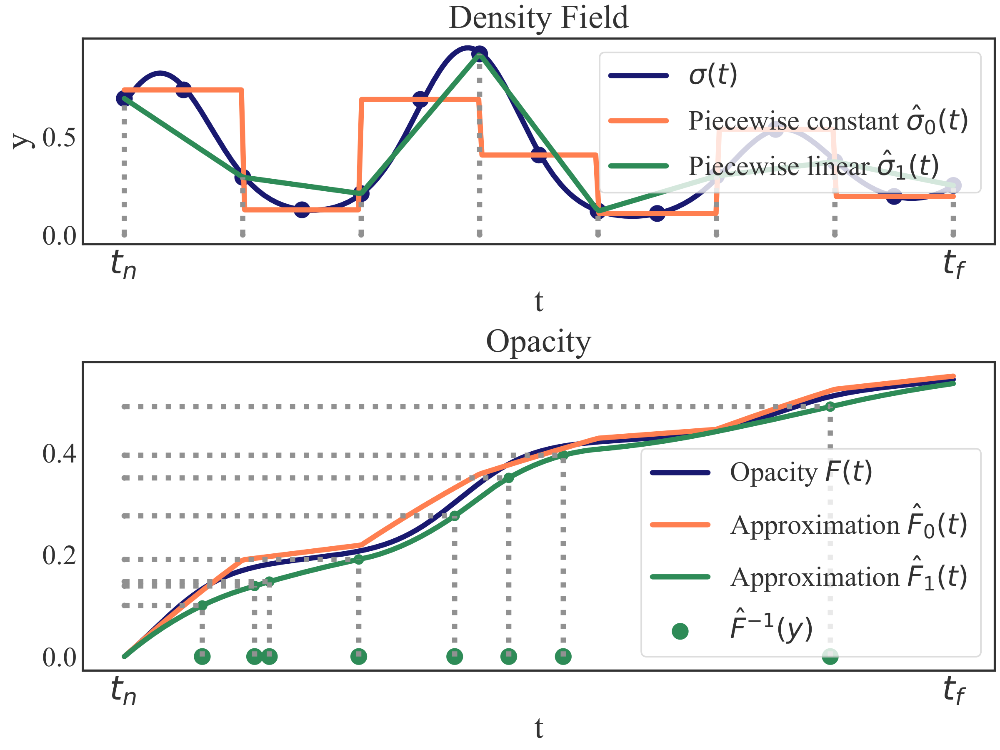

# Differentiable Rendering with Reparameterized Volume Sampling

Code release for our paper [Differentiable Rendering with Reparameterized Volume Sampling](https://arxiv.org/abs/2302.10970).

Nikita Morozov, Denis Rakitin, Oleg Desheulin, Dmitry Vetrov, Kirill Struminsky



## Abstract

In view synthesis, a neural radiance field approximates underlying density and radiance fields based on a sparse set of scene pictures. To generate a pixel of a novel view, it marches a ray through the pixel and computes a weighted sum of radiance emitted from a dense set of ray points.
This rendering algorithm is fully differentiable and facilitates gradient-based optimization of the fields. However, in practice, only a tiny opaque portion of the ray contributes most of the radiance to the sum. We propose a simple end-to-end differentiable sampling algorithm based on inverse transform sampling. It generates samples according to the probability distribution induced by the density field and picks non-transparent points on the ray. We utilize the algorithm in two ways. First, we propose a novel rendering approach based on Monte Carlo estimates. This approach allows for evaluating and optimizing a neural radiance field with just a few radiance field calls per ray. Second, we use the sampling algorithm to modify the hierarchical scheme proposed in the original NeRF work. We show that our modification improves reconstruction quality of hierarchical models, at the same time simplifying the training procedure by removing the need for auxiliary proposal network losses.

## 1D Experiments

Notebook `1d_experiments.ipynb` contains RVS sampling algorithm implementation and single ray experiments from the paper.

## Differentiable Hierarchical Sampling

Our NeRF implementation is based on [nerf-pytorch](https://github.com/yenchenlin/nerf-pytorch) repository and follows the same structure. 

Training NeRF with RVS algorithm for differentiable hierarchical sampling: 

```
cd nerf
python run_nerf.py --config configs/{SCENE}_rvs.txt
```

replace `{SCENE}` with `trex` | `horns` | `flower` | `ship` | `lego` | etc.

Testing:

```
python run_nerf.py --config configs/{SCENE}_rvs.txt --render_only
```

## Citation

```
@article{morozov2023differentiable,
  title={Differentiable Rendering with Reparameterized Volume Sampling},
  author={Morozov, Nikita and Rakitin, Denis and Desheulin, Oleg and Vetrov, Dmitry and Struminsky, Kirill},
  journal={arXiv preprint arXiv:2302.10970},
  year={2023}
}
```
